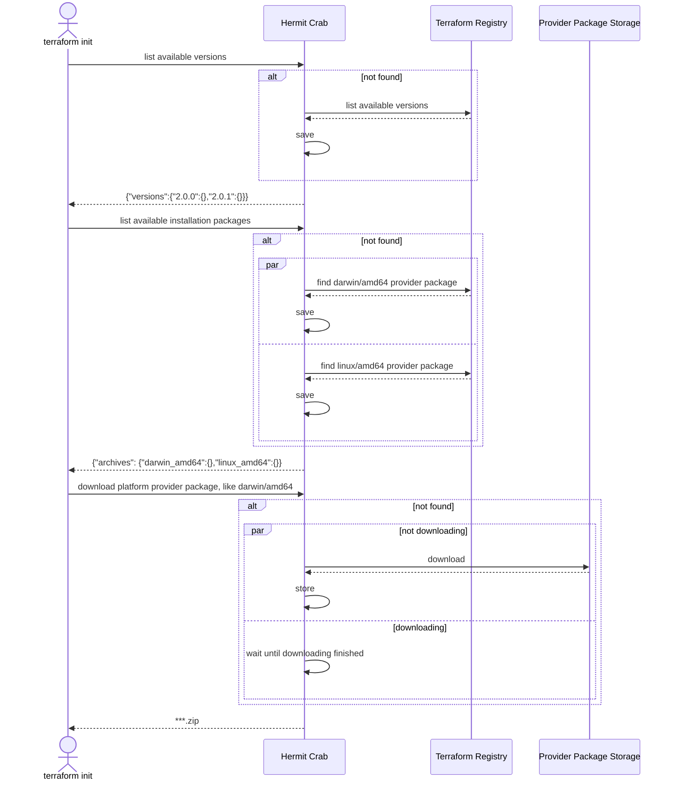

# Hermit Crab 

> tl;dr: Available Terraform/OpenTofu Provider network mirroring service.

[](https://goreportcard.com/report/github.com/seal-io/hermitcrab)
[](https://github.com/seal-io/hermitcrab/actions)
[](https://hub.docker.com/r/sealio/hermitcrab/tags)
[](https://github.com/seal-io/hermitcrab/releases) 
[](https://github.com/seal-io/hermitcrab#license)

Hermit Crab provides a stable and reliable [Terraform](https://registry.terraform.io/browse/providers)/[OpenTofu](https://opentofu.org/registry/) Provider network mirror service. 

This tool is maintained by [Seal](https://github.com/seal-io).



## Background

When we drive [Terraform](https://www.terraform.io/) at some automation scenarios, like CI, automatic deployment, etc., we need to download the Provider plugins from the internet by `init` command. 

Depending on [Terraform Provider Registry Protocol](https://developer.hashicorp.com/terraform/internals/provider-registry-protocol), we may download a plugin that is not cached from an unstable networking remote.

To mitigate the effect of unstable networking, there are two ways to solve this: [Implied Mirroring](https://developer.hashicorp.com/terraform/cli/config/config-file#implied-local-mirror-directories) and [Network Mirroring](https://developer.hashicorp.com/terraform/cli/config/config-file#network_mirror).

As far as **Implied Mirroring** is concerned, it works well when a Provider matches the [Version Constraints](https://developer.hashicorp.com/terraform/language/expressions/version-constraints). However, this mode fails when the version is not cached in the local file directory.

```
╷
│ Error: Failed to query available provider packages
│
│ Could not retrieve the list of available versions for provider
```

What's even more troublesome is that if the version changes, we need to continuously maintain this local file directory.

**Network Mirroring**, different from **Implied Mirroring**, can maintain all versions(including the latest) at a nearby network and allows distributed Terraform working agents to share the same mirroring package.

## Usage

Hermit Crab implements the [Terraform](https://developer.hashicorp.com/terraform/internals/provider-registry-protocol)/[OpenTofu](https://opentofu.org/docs/internals/provider-network-mirror-protocol/) Provider Registry Protocol and acts as a mirroring service.

Hermit Crab can be easily served through [Docker](https://www.docker.com/).

```shell
docker run -d --restart=always -p 80:80 -p 443:443 sealio/hermitcrab
```

Hermit Crab saves the mirrored(downloaded) packages in the `/var/run/hermitcrab` directory by default, which can be persisted by mounting a volume.

```shell
docker run -d --restart=always -p 80:80 -p 443:443 \
  -v /tmp/hermitcrab:/var/run/hermitcrab \
  sealio/hermitcrab
```

Hermit Crab manages the archives as the following layer structure, which is absolutely compatible with the output of [`terraform providers mirror`](https://developer.hashicorp.com/terraform/cli/commands/providers/mirror)/[`tofu providers mirror`](https://opentofu.org/docs/cli/commands/providers/mirror).

```
/var/run/hermitcrab/data/providers
├── /<HOSTNAME>
│   ├── /<NAMESPACE>
│   │   ├── /<TYPE>
│   │   │   ├── terraform-provider-<TYPE>_<VERSION>_<OS>_<ARCH>.zip
```

Hermit Crab also can reuse the mirroring providers prepared by `terraform providers mirror`/`tofo providers mirror`.

```shell
terraform providers mirror /tmp/providers-plugins

docker run -d --restart=always -p 80:80 -p 443:443 \
  -v /tmp/providers-plugins:/usr/share/terraform/providers/plugins \
  sealio/hermitcrab
```

Terraform/OpenTofu Provider Network Mirror protocol wants [HTTPS](https://en.wikipedia.org/wiki/HTTPS) access, Hermit Crab provides multiple ways to achieve this.

- Use the default self-signed certificate, no additional configuration is required.

  Since Terraform always verifies the certificate insecure or not, under this mode, we need to import the self-signed certificate into the trusted certificate store.

  ```shell
  # download the self-signed certificate
  echo quit | openssl s_client -showcerts -servername <YOUR_SERVER> -connect <YOUR_ADDRESS> 2>/dev/null | openssl x509 -outform PEM >server.pem
  ```  

- Using [ACME](https://en.wikipedia.org/wiki/Automatic_Certificate_Management_Environment) to [gain a trusted certificate](https://letsencrypt.org/docs/challenge-types/), need a domain name and a DNS configuration.

  ```shell
  docker run -d --restart=always -p 80:80 -p 443:443 \
    -e SERVER_TLS_AUTO_CERT_DOMAINS=<YOUR_DOMAIN_NAME> \
    sealio/hermitcrab
  ```

- Use a custom certificate.
  
  ```shell
  docker run -d --restart=always -p 80:80 -p 443:443 \
    -v /<YOUR_PRIVATE_KEY_FILE>:/etc/hermitcrab/ssl/key.pem \
    -v /<YOUR_CERT_FILE>:/etc/hermitcrab/ssl/cert.pem \
    -e SERVER_TLS_PRIVATE_KEY_FILE=/etc/hermitcrab/ssl/key.pem \
    -e SERVER_TLS_CERT_FILE=/etc/hermitcrab/ssl/cert.pem \
    sealio/hermitcrab
  ```

Also support to launch from Helm Chart.

```shell
# latest version
helm install my-release oci://ghcr.io/seal-io/helm-charts/hermitcrab
# with specific version
helm install my-release oci://ghcr.io/seal-io/helm-charts/hermitcrab --version <VERSION>
```

After setting up Hermit Crab, you can make the [Terraform](https://developer.hashicorp.com/terraform/cli/config/config-file)/[OpenTofu](https://opentofu.org/docs/cli/config/config-file/) CLI Configuration File as below to use the mirroring service.

```hcl
provider_installation {
  network_mirror {
   url = "https://<ADDRESS>/v1/providers/"
  }
}
```

## Notice

Hermit Crab is not a [Terraform Registry](https://registry.terraform.io), although implementing these protocols is not difficult, there are many options that you can choose from, like [HashiCorp Terraform Enterprise](https://www.hashicorp.com/products/terraform/pricing/), [JFrog Artifactory](https://jfrog.com/help/r/jfrog-artifactory-documentation/terraform-registry), etc.

Hermit Crab cannot mirror [Terraform Module](https://developer.hashicorp.com/terraform/internals/module-registry-protocol), since obtaining Terraform modules is diverse, like [Git](https://developer.hashicorp.com/terraform/language/modules/sources#generic-git-repository), [HTTP URLs](https://developer.hashicorp.com/terraform/language/modules/sources#http-urls), [S3 Bucket](https://developer.hashicorp.com/terraform/language/modules/sources#gcs-bucket) and so on, it's hard to provide a unified way to mirror them.

Hermit Crab doesn't support rewriting the provider [hostname](https://developer.hashicorp.com/terraform/internals/provider-network-mirror-protocol#hostname), which is a rare case and may make template/module reusing difficult. One possible scenario is that there is a private Terraform Registry in your network, and you need to use the community template/module without any modification.

Hermit Crab automatically synchronizes the in-use versions per 30 minutes, if the information update occurs during sleep, we can manually trigger the synchronization by sending a `PUT` request to `/v1/providers/sync`.

Hermit Crab only performs a checksum verification on the downloaded archives. For archives that already exist in the implied or explicit directory, checksum verification is not performed.

Hermit Crab only allows downloading the archives whose name matches the [Terraform Release Rules](https://developer.hashicorp.com/terraform/registry/providers/publishing#manually-preparing-a-release), which means the archive name must be `terraform-provider-<TYPE>_<VERSION>_<OS>_<ARCH>.zip`.

# License

Copyright (c) 2023 [Seal, Inc.](https://seal.io)

Licensed under the Apache License, Version 2.0 (the "License");
you may not use this file except in compliance with the License.
You may obtain a copy of the License at [LICENSE](./LICENSE) file for details.

Unless required by applicable law or agreed to in writing, software
distributed under the License is distributed on an "AS IS" BASIS,
WITHOUT WARRANTIES OR CONDITIONS OF ANY KIND, either express or implied.
See the License for the specific language governing permissions and
limitations under the License.
